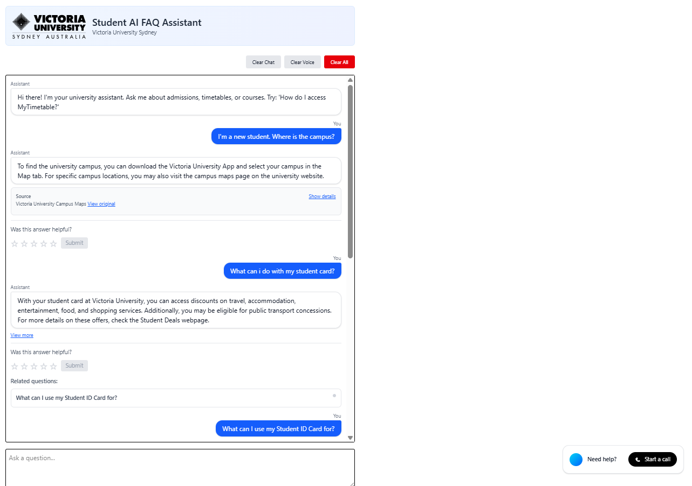
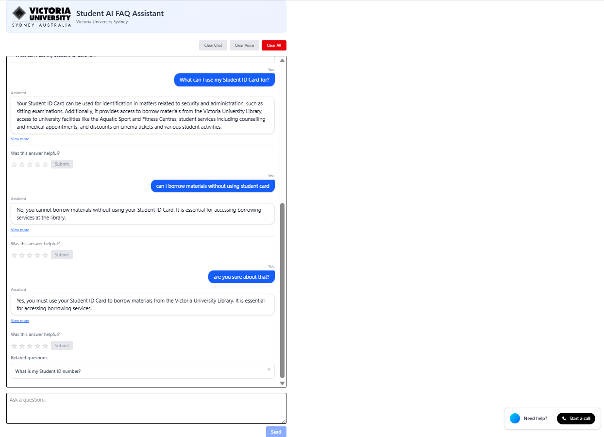

# AI Conversational Admissions Assistant

A conversational AI system designed to help university staff and students get quick, accurate answers to their questions about university services, policies, and procedures.

> **Private Repository Notice**
> This is an ongoing private project containing proprietary and confidential code. This repository is restricted to authorized personnel only and is not intended for public access or distribution.




## What This System Does

The chat assistant provides instant, helpful responses to questions about:
- Academic policies and procedures
- Student services and support
- IT systems and access
- Financial aid and fees
- Campus life and facilities
- And much more

## How It Works

### For Students and Staff
1. **Ask a question** - Type your question in plain English
2. **Get instant answers** - The system searches our knowledge base and provides focused, relevant answers
3. **Follow up naturally** - Ask follow-up questions like "tell me more about that" or "what was the first option?"
4. **Click suggestions** - When available, click suggested related questions for quick, focused answers

### Key Features
- **Real-time streaming** - Answers appear as they're generated for fast response
- **Conversation memory** - The system remembers your conversation context
- **Smart suggestions** - Get related questions to explore topics further
- **Reliable answers** - Built on comprehensive university knowledge base
- **Privacy-focused** - Conversation data expires automatically for your privacy

## Getting Started

### For End Users (Students & Staff)
Simply visit the chat interface and start asking questions. No login required - the system works immediately.

### For Developers
This project consists of:
- **Backend**: FastAPI-based chat service with vector search and LLM integration
- **Frontend**: Next.js chat interface with real-time streaming
- **Knowledge Base**: PostgreSQL + ChromaDB for FAQ storage and vector search

## Technical Documentation

For detailed technical information about how the system works end-to-end, see:
**[End-to-End System Overview](backend/system-docs/end-to-end-system-overview.md)**

This document explains:
- Complete user journey flows
- System architecture and components
- How conversation history is maintained
- Error handling and fallback mechanisms
- Performance and scalability considerations

## Project Structure

```
├── backend/                 # FastAPI backend service
│   ├── src/app/            # Main application code
│   ├── system-docs/        # System documentation
│   └── tests/              # Backend tests
├── frontend/               # Next.js frontend
│   ├── app/                # Main application pages
│   ├── components/         # React components
│   └── lib/                # Utility libraries
└── README.md               # This file
```

## Key Technologies

- **Backend**: Python, FastAPI, PostgreSQL, ChromaDB, Redis, OpenAI
- **Frontend**: Next.js, React, TypeScript, Tailwind CSS
- **AI/ML**: OpenAI GPT models, vector embeddings, semantic search
- **Infrastructure**: Docker, Redis for session management

## Planned Enhancements

### TODO: Vector Database Migration
- **Current**: ChromaDB for vector search and similarity matching
- **Target**: Migrate to Weaviate for improved search capabilities
- **Benefits**:
  - Weaviate's hybrid search combines vector search with keyword-based BM25F search
  - Provides more comprehensive and relevant results by leveraging both semantic understanding and exact keyword matching
  - Better handling of exact phrase matches and keyword-based queries
  - Improved performance for mixed query types (semantic + keyword)

### TODO: Performance Evaluation System
- **Current**: Basic observability through structured logging and metrics collection
- **Target**: Implement comprehensive performance evaluation framework
- **Components**:
  - Automated performance benchmarks for search accuracy and response quality
  - User experience metrics (response time, satisfaction scoring, error rates)
  - System performance monitoring (throughput, latency, resource utilization)
  - A/B testing framework for feature validation and optimization
  - Automated regression testing for search quality and conversation flows

## Support

For technical issues or questions about the system:
- Check the [End-to-End System Overview](backend/system-docs/end-to-end-system-overview.md) for detailed technical information
- Contact the development team for system-specific issues

For questions about university policies or services:
- Use the chat assistant - it's designed to help with these questions!
- Contact relevant university departments for complex or specific inquiries

---

*This system is designed to provide quick, accurate answers to common university questions. For complex or sensitive matters, please contact the appropriate university department directly.*
