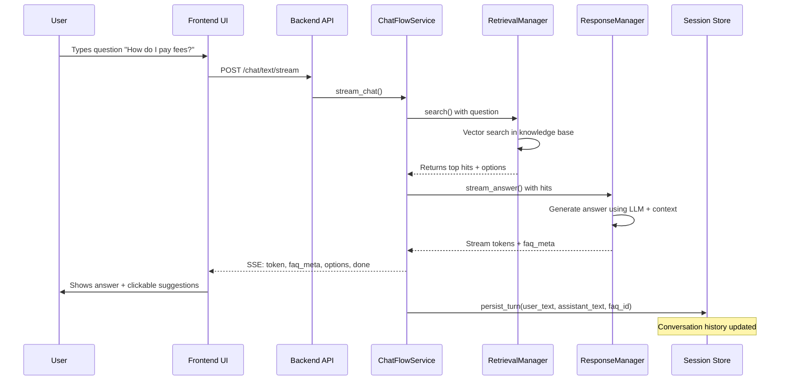
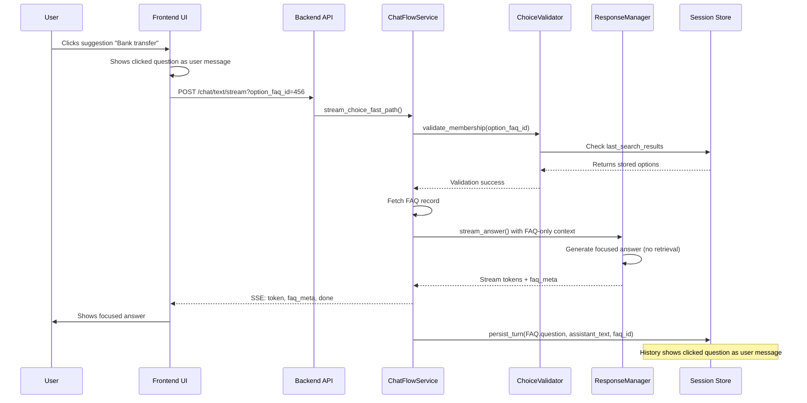
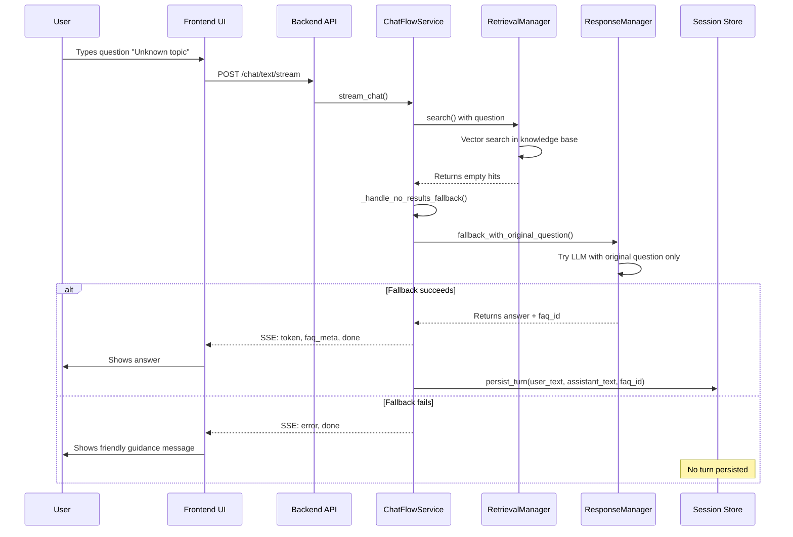
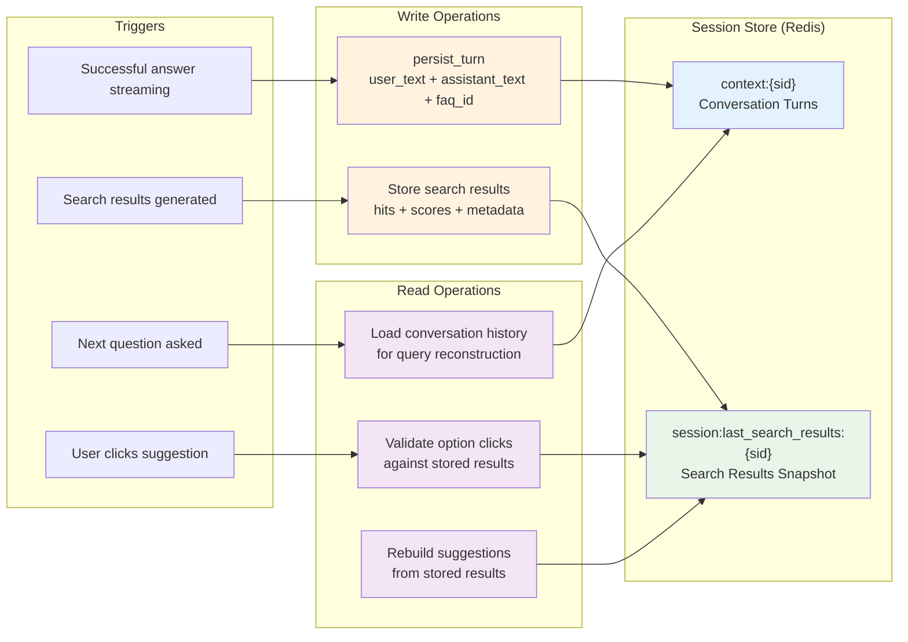
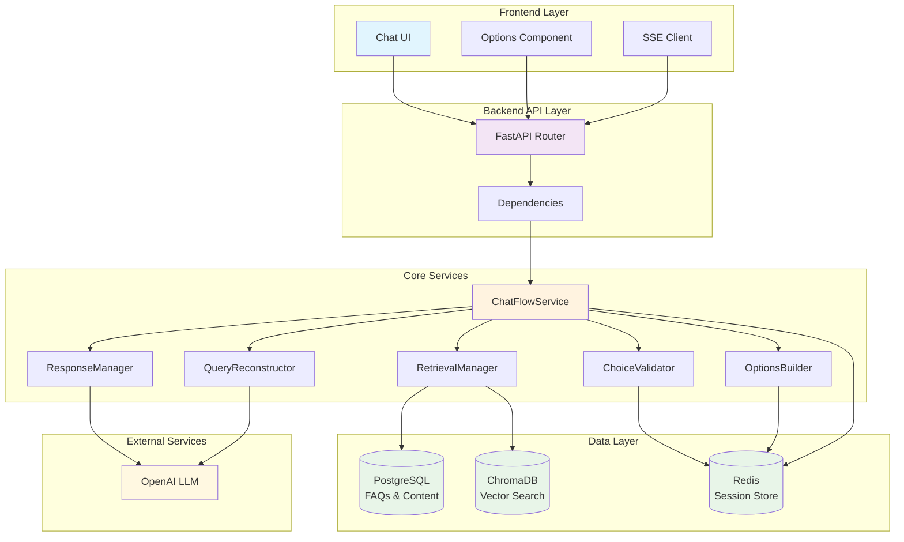
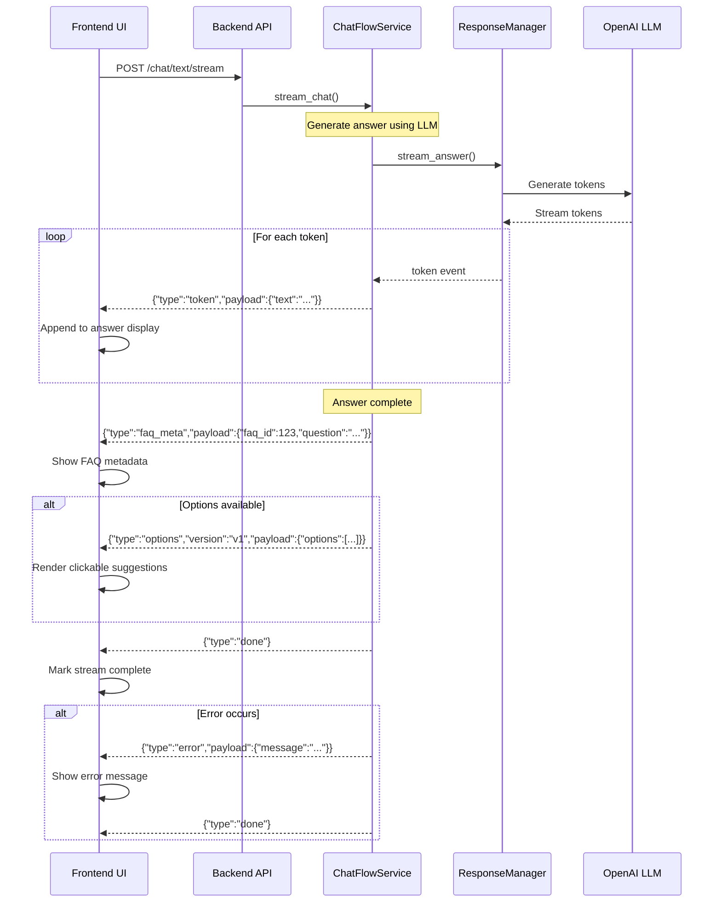
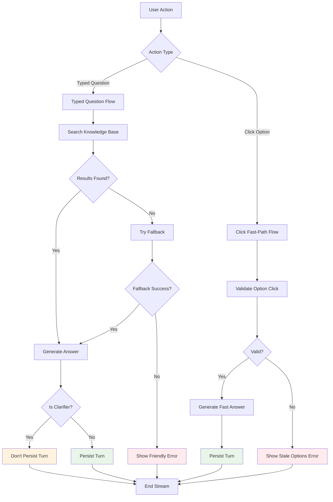

# End-to-End System Overview

Version: 1.0
Audience: Project Managers, Product Owners, Stakeholders
Purpose: Explain how the chat system works from a user’s first input to the streamed answer, including how conversation history is maintained.

## Executive Summary
- The system helps users ask questions and get focused answers, quickly and reliably.
- Users can either type a question or click a suggested related option. Answers stream in real time for responsiveness.
- The system remembers conversation context so follow‑up questions like "that" or "tell me again" feel natural.

## User Journeys

### 1) Typed Question Flow



### 2) Click Fast‑Path Flow



### 3) No‑Results Fallback Flow



## Conversation History Data Flow


## How the System Remembers Your Conversation

The chat system keeps track of your conversation so it can provide helpful, contextual responses. Here's how it works:

### What Gets Remembered
- **Your questions and the assistant's answers**: Each exchange is saved so the system can understand what you've already discussed
- **The most recent answer's source**: When the assistant answers from a specific FAQ, it remembers which one so follow-up questions can reference it
- **Available suggestions**: The system remembers what options were presented to you, so clicking them works correctly

### How It Works
- **After successful answers**: When the assistant provides a helpful answer, the conversation is automatically saved
- **For clicked suggestions**: When you click a suggested question, the system saves that clicked question as your message (so the conversation reads naturally)
- **Smart updates**: The system refreshes the available suggestions whenever new options are presented
- **Quality control**: Confusing responses or errors are not saved, keeping the conversation history clean and useful

### When Information Is Saved
- **Typed questions**: Saved immediately after the assistant finishes providing a helpful answer
- **Fallback answers**: Only saved if the system finds a good answer after the initial search fails
- **Clicked suggestions**: Saved after the focused answer is provided (clicking the same suggestion again won't create duplicates)

### Why This Matters
- **Natural conversations**: You can ask follow-up questions like "tell me more about that" or "what was the first option again?"
- **Accurate history**: The conversation shows exactly what you asked and what the assistant answered
- **Reliable suggestions**: Clicked suggestions always work because the system validates them against the latest available options

### Privacy and Freshness
- **Automatic cleanup**: Conversation data expires after periods of inactivity to protect your privacy
- **Fresh suggestions**: If suggestions become outdated, the system automatically provides new ones instead of failing

## High‑Level Architecture



- Frontend (Web): A chat UI that shows messages, renders suggestion chips, and connects to a streaming endpoint.
- Backend (API): A chat endpoint that orchestrates searching, answering, and streaming responses back to the browser.
- Knowledge & State: A structured knowledge base for FAQs and content, plus a session store for conversation history and the latest search results snapshot.

## SSE Streaming Flow



Example stream (simplified):
```json
{"type":"token","payload":{"text":"To pay your fees,"}}
{"type":"token","payload":{"text":" you can use bank transfer..."}}
{"type":"faq_meta","payload":{"faq_id":123,"question":"How do I pay my fees?","source_url":null}}
{"type":"options","version":"v1","payload":{"options":[{"index":1,"faq_id":456,"question":"Bank transfer","score":0.92}]}}
{"type":"done"}
```

## Retrieval and Suggestions
- Defaults guide how many items are searched and presented:
  - Top‑K search returns up to 4 results; the top result becomes the main answer.
  - Up to 3 additional suggestions are presented (excluding the top result so we don’t duplicate content).
  - A minimum relevance score ensures low‑quality results are filtered out.
- Suggestions are “click‑first”: users should click the suggestion chip/link. If users type “1/2/3” or the option title, it’s treated as a new question and goes through the full pipeline.

## Answer Generation
- Typed questions: the answer is generated using relevant content and the conversation history to keep the reply coherent with prior turns.
- Click fast‑path: the answer is generated directly from the selected FAQ’s content. This skips additional searching and produces a fast, focused answer.

## Clarifier and Fallback Behavior
- The assistant is encouraged to answer whenever possible.
- If there isn’t enough clarity to provide a reliable answer, it may produce a short clarifier. Clarifier messages are not saved as final turns.
- If no results are found, the system tries a last‑chance fallback using the original question (without extra context). If a clear answer is found, it is streamed and saved. Otherwise, a friendly guidance message is returned.

## Error Handling Workflow



## Observability and Success Signals
- We track key operational and product signals, such as:
  - Time to first streamed token and time to final “done”.
  - How often users choose the click fast‑path vs. typing a follow‑up.
  - How often retrieval can be skipped because the system already has enough context.
- These signals guide performance improvements and product decisions.

## Performance and Scalability
- Streaming provides fast perceived responsiveness.
- The click fast‑path reduces extra searching, improving both performance and cost efficiency.

## Security and Privacy
- Conversation history is session‑based and expires after inactivity.
- We store only what is needed to deliver accurate, contextual answers and validate suggestion clicks.

## Configuration Defaults (Business‑Level)
- Sensible defaults ensure consistent behavior: how many results we consider, how many suggestions we show, and the relevance threshold for quality.

## Examples (Appendix)
### Example A — Typed Question with Suggestions
- User: “How do I pay my fees?”
- Assistant streams the answer and presents 3 suggestions (e.g., bank transfer, due dates, international payments).
- The turn is saved after the answer finishes.

### Example B — Click Fast‑Path (Focused Answer)
- User clicks “Bank transfer”.
- The UI shows the clicked question as a user message, then streams the focused answer.
- The turn is saved; re‑clicking does not duplicate the history.

### Example C — No Results → Fallback → Success
- The initial search finds nothing relevant.
- The fallback with the original question finds a clear answer and streams it.
- The turn is saved.

### Example D — No Results → Fallback → Still No Answer
- Neither the initial search nor fallback produces a reliable answer.
- The system returns a friendly message guiding the user to rephrase or try another topic.
- The turn is not saved because there is no conclusive answer.
